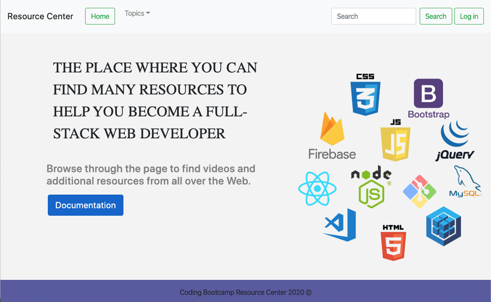

# project-3

<h2> <a href="https://pure-sierra-79921.herokuapp.com/">A resource center for learning developers</a></h2>

The Resource Center was built as a place to gather helpful links and information for developers.

<h2>How it works</h2>

This project uses MongoDB to store and display new content. There are many topics centered around different languages and libraries. As there is new content and features every day, you are able to log in and add new content that will then be displayed on its respective page.

&nbsp;
<!--  -->

<h3>This project was built with:</h3>
<ul>
    <li>React</li>
    <li>HTML</li>
    <li>JavaScript</li>
    <li>CSS</li>
    <li>Reactstrap</li>
    <li>mongoDB</li>
    <li>Mongoose</li>
    <li>Auth0</li>
    <li>Express</li>
    <li>Node</li>
    <li>Hosted on Heroku</li>
</ul>
<h3>Group Members</h3>
<ul>
    <li>Alex Ogilvie</li>
    <li>Ben Linton</li>
    <li>Chason Law</li>
    <li>Lucas Difini</li>
</ul>
